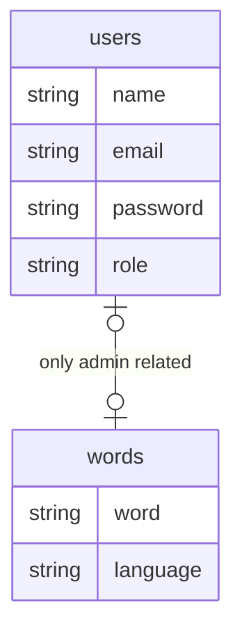
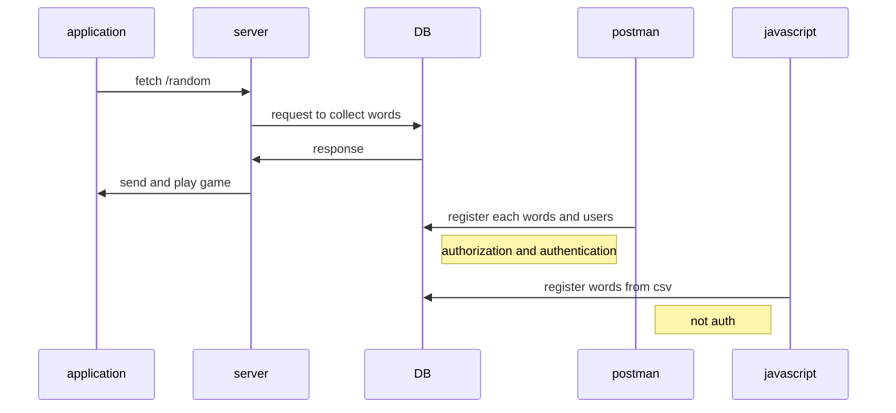

# Typing app for programmers.
-----------------------------------------

### アプリ紹介
プログラマーがコードを素早く打てるようにプログラマ向けのタイピングアプリを制作しました。

使用する単語は全てプログラミングと関わりのある単語になっています。

### 機能（バックエンド）
- 言語によって出題する単語を切り替える
- DBに保存している単語をfetchして一定数取り出す
- DBに登録している単語を確認するAPI、クエリ操作でpagination機能
- RESTful API、単語の追加、確認、更新、削除
- CSVからの単語一括登録
- ユーザーの登録、ログイン
- パスワードをhashを使った暗号化(bcript)
- JWT(jsonwebtoken)を使った認可と認証

### Tools
メイン言語
`JavaScript, Node.js`

webフレームワーク
`Express`

Database
`Mongo db - atlas, Hosting service`

テンプレートエンジン
`Handlebars`

Deployment
`Heroku`

---
## Database Schema

---

